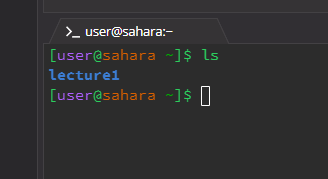
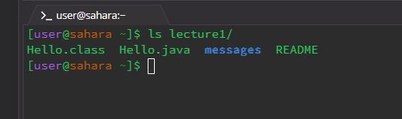
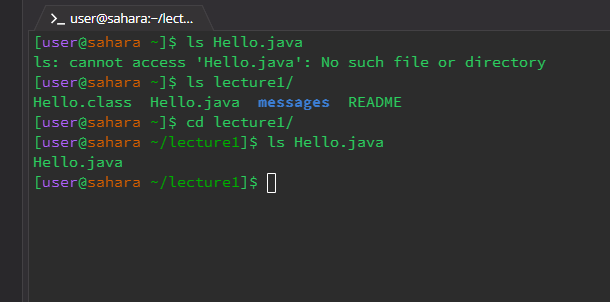
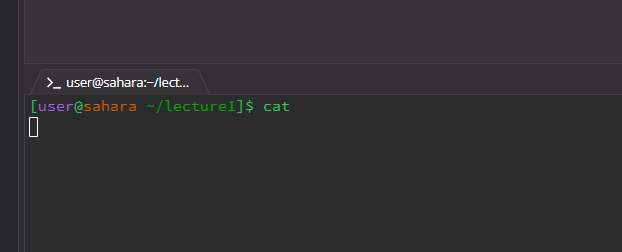
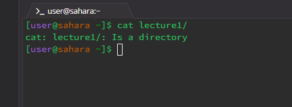
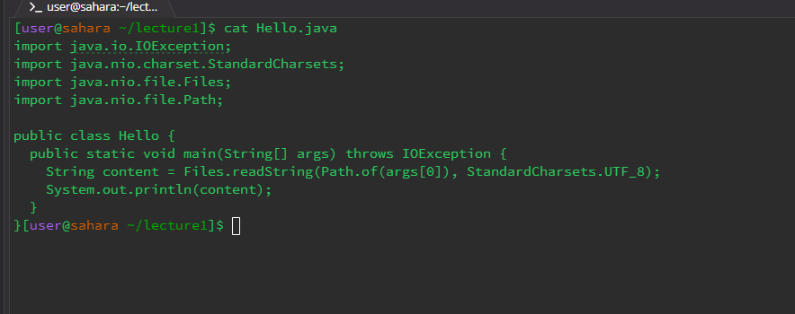

# **Cd**
No Arguments
```
[user@sahara ~]$ cd
[user@sahara ~]$
```
The working directory was the /home directory. cd is used to change directories, but if no directory is specified, it goes to /home directory. The output is not an error.

Path to Directory
   ```
   [user@sahara ~]$ cd /home/lecture1
   [user@sahara ~/lecture1]$
   ```
   The working directory was /home directory. cd is used to change directories and the path specified was to lecture1, therefore we switched to lecture1. The output is not an error because this is a valid command.

Path to File
   ```
 [user@sahara ~]$ cd lecture1/
 [user@sahara ~/lecture1]$ cd Hello.java 
 bash: cd: Hello.java: Not a directory
   ```
 The working directory was /lecture1. cd only changes directories. It cannot change to files. The output is an error because Hello.java (the file specified) is not a directory.

# **ls**
1. No Arguments
   * 
   * the working directory was home
   * ls lists the files and folders inside a directory. We were in home directory and the folder inside the home directory was lecture 1
   * the output is not an error
  
2. Path to Directory
   * 
   * the working directory was home
   * ls listed the files and folders inside the lecture1 directory when we specified that as the path
   * the output is not an error because lecture1 was in the home directory (pwd) 

3. Path to File
   * 
   * the working directory was lecture1
   * ls just simply listed the name of the file because the pathname was a file. If we wanted to know more about the file, we would have to use other commands
   * the output is not an error

# **cat**
1. No Arguments
   * 
   * the working directory was home directory
   * cat reads output from file and gives its content as an output. If no argument is given, it simply reads from the standard input
   * the output is not an error
     
2. Path to Directory
   * 
   * the working directory was home directory
   * the directory lecture1 is a directory, not a file. Therefore, an error was thrown because cat only reads output from files
   * the output is an error because cat only reads output from files
     
3. Path to File
   * 
   * the working directory was lecture1
   * the path specified was a file, so cat read the contents of the file
   * the output is not an error
