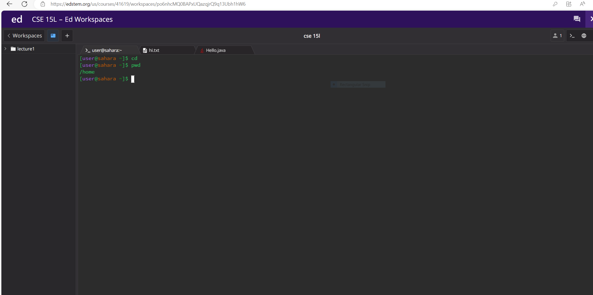

# **CD**
1. No Arguments
  * 
  * the working directory was in home directory 
  * cd is used to change directory, but if no argument is specified, it goes to home directory
  * The output is not an error 

2. Path to Directory
   * 
