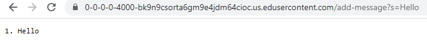

# Lab Report 2 - Servers and SSH Keys (Week 3)

## Part 1

- The handleRequest method and the main method are called
- The main method has a String parameter named args, which is used to take in the port number. The handleRequest method as a URI parameter named url which indexes the URL up until the beginning of the path.
- The value of the main method parameter is 4000 because that is the port number we set it to.
- The value of the handleRequest's parameter is localhost:
- Some of the other relevant values include cat, counter, and new_param. cat is initialized to "" as that is the variable that will be used to concatenate the display message. Counter is initialized to 0 and new_param is initialzed to null.
- When implementing /add-message?s=Hello, cat, counter, new_param, and url are all changed. cat goes from "" to "Hello". counter goes from 0 to 1. new_param goes is now set to the string stored in the first index of parameters. url is changed to localhost:4000/add-message?s=Hello.


- The handleRequest method and main method are called
- The relevant arguments are args and url
- The relevant values are cat, counter, and new_param
- The url changes from localhost:4000/add-message?s=Hello to localhost:4000/add-message?s=How%20are%20you. cat changes from "Hello" to "Hello\nHow are you". counter gets incremented from 1 to 2 and new_params replaces to "+" to " ".

**StringServer.java**
```
import java.io.IOException;
import java.net.URI;

class Handler implements URLHandler {
    // The one bit of state on the server: a number that will be manipulated by
    // various requests.
    int counter = 0;
    String cat = "";
    String new_param;

    public String handleRequest(URI url) {
        if (url.getPath().equals("/")) {
            return String.format(cat);
        } else {
            if (url.getPath().contains("/add-message")) {
                String[] parameters = url.getQuery().split("=");
                if (parameters[0].equals("s")) {
                    counter += 1;
                    new_param = parameters[1];
                    new_param = new_param.replace("+", " ");
                    cat += Integer.toString(counter) + ". " + new_param + "\n";
                    return String.format(cat);
                }
            }
            return "404 Not Found!";
        }
    }
}

class StringServer {
    public static void main(String[] args) throws IOException {
        if(args.length == 0){
            System.out.println("Missing port number! Try any number between 1024 to 49151");
            return;
        }

        int port = Integer.parseInt(args[0]);

        Server.start(port, new Handler());
    }
}
```
## Part 2

